# Run Flow — from recording to report

This is the whole lifecycle of a test case, end to end: how a manual session becomes
CSV-driven steps (codegen → importer → optional AI agent), how the data and config get
wired in, how validation gates the run, and how one iteration actually executes (design
phase, optional chained simulation) and reports.

> The interactive, code-level walkthrough of the **run** portion lives in the published
> artifact (a play-through of the real code at each stage). This file is the source of
> truth for the diagram and can be rendered anywhere Mermaid is supported (GitHub, VS Code).

## Outcomes legend

| State | Meaning |
| --- | --- |
| `BASELINE_CREATED` | First green run — the baseline was written, nothing to compare against yet. |
| `PASS` | Extracted result cells matched the baseline. |
| `FAIL` | At least one cell differed (a diff CSV is written). |
| `SKIP` | A step was not applicable this iteration — blank / `N/A` data, or a `Computed` (greyed/disabled) field. |

## Full lifecycle

```mermaid
flowchart TD
  %% ========== 1. AUTHOR AND RECORD (human) ==========
  subgraph P0["1 · Author + Record — human, once per feature"]
    direction TB
    REC["Playwright codegen<br/>records the manual clicks"]
    REC --> RECF["recording.txt<br/>(sim_recording.txt for the sim flow)"]
    TDATA["hand-authored testdata<br/>01_testdata/project.csv · inputset.csv · simulation.csv"]
  end

  %% ========== 2. IMPORT (deterministic + optional AI) ==========
  subgraph P1["2 · Import — a recording + data become CSV steps"]
    direction TB
    IMP["npm run import-codegen -- Module feature_X --tc TC_04<br/>scripts/import-codegen.ts"]
    IMPSIM["--sim mode<br/>sim_recording.txt turns into sim_metadata.csv"]
    AI["/import-feature AI agent — optional judgment layer<br/>greyed-field asserts · N/A skips · screenshot-verify"]
  end
  RECF --> IMP
  TDATA --> IMP
  RECF --> IMPSIM
  IMP --> GEN["generated / merged:<br/>00_config/feature.config.json<br/>03_metadata/metadata.csv<br/>02_selectors_repo/selectors.csv"]
  IMPSIM --> GENSIM["03_metadata/sim_metadata.csv"]
  GEN --> AI
  GENSIM --> AI

  %% ========== 3. CONFIGURE ==========
  subgraph P2["3 · Configure — wire the test case in"]
    direction TB
    MAS["master.csv row<br/>Module · Feature · TestCase · Run · Simulation"]
    BASE["06_baseline (per env) + compare.config.csv<br/>first green run writes the baseline"]
  end
  AI --> MAS

  %% ========== 4. VALIDATE ==========
  VAL{"npm run validate<br/>core/schema/validator.ts<br/>every CSV cross-checked"}
  MAS --> VAL
  GEN --> VAL
  GENSIM --> VAL
  VAL -- issue --> STOP["abort · exit 1 · browser never launches"]

  %% ========== 5. RUN (design phase) ==========
  VAL -- clean --> RUN["npm run test -- --testcase TC_04<br/>core/cli/index.ts"]
  RUN --> ORCH["testCommand · core/runner/orchestrator.ts<br/>loadMaster · loadFeature · loadSimSteps"]
  ORCH --> TASKS["build tasks — one per iteration<br/>Run=FALSE vetoes that iteration"]
  TASKS --> ITER["runIteration · core/runner/iterationRunner.ts<br/>launch browser · page.goto(baseUrl)"]
  ITER --> MAIN["executeMain — DESIGN phase<br/>core/runner/executeSteps.ts"]
  MAIN --> STEP["runSteps · per step<br/>core/runner/stepRunner.ts"]
  STEP --> ACT["resolve data tokens · skip rules (blank / N/A / Computed)<br/>dispatch keyword + retry → keyword acts on page"]
  ACT -->|next step| STEP
  STEP -->|last step| EXT["extractAllResultTables<br/>custom/_shared/customSteps.ts"]
  EXT --> CMP{"compareWithBaseline<br/>core/comparator/runCompare.ts"}
  CMP -- no baseline --> BC["write baseline · BASELINE_CREATED"]
  CMP -- baseline --> PF["compareRows → PASS / FAIL + diff"]

  %% ========== 6. SIMULATE (optional, chained) ==========
  BC --> SIMQ{"design green<br/>AND Simulation=YES?"}
  PF --> SIMQ
  SIMQ -- yes --> SIM["SIM phase · resultPrefix = sim_<br/>Simulate → confirmSimulateModal"]
  SIM --> SIMW["wait Simulation row → Completed"]
  SIMW --> SIMX["extract sim_results · compare sim_baseline"]
  SIMX --> CLEAN["runCleanup · delete project"]
  SIMQ -- no --> CLEAN

  %% ========== 7. REPORT ==========
  CLEAN --> STAT["status = worst(design, sim)"]
  STAT --> REP["writeReports · core/reporters/*"]
  REP --> OUT["combined.html · junit.xml · results.json"]
```

## The seven phases

1. **Author + Record** — a human clicks through the app once under Playwright codegen; the
   trace lands in `recording.txt` (and `sim_recording.txt` for the simulation flow). Testdata
   CSVs are authored by hand — the importer binds recorded literals to these columns, it does
   not invent them.
2. **Import** — `npm run import-codegen` deterministically turns the recording plus testdata
   into `feature.config.json`, `metadata.csv`, and `selectors.csv`; `--sim` produces
   `sim_metadata.csv`. The `/import-feature` AI agent is an *optional* judgment layer on top:
   it adds assertions for greyed/`Computed` fields, marks `N/A` skips, and screenshot-verifies
   every iteration (green ≠ correct).
3. **Configure** — the `master.csv` row selects the test case and flips `Run` / `Simulation`;
   the baseline folder + `compare.config.csv` define what "matching" means (the first green run
   writes the baseline).
4. **Validate** — `npm run validate` cross-checks every CSV before any browser opens; any issue
   aborts with exit 1.
5. **Run (design)** — the orchestrator loads the feature, builds one task per iteration
   (`Run=FALSE` vetoes), launches the browser, and executes the design steps; the last step
   extracts every result table and compares it against the baseline.
6. **Simulate (optional, chained)** — only when the design is green *and* `Simulation=YES`, the
   same browser continues into the simulation flow (`resultPrefix = sim_`), waits for the
   Simulation row to reach *Completed*, extracts, and compares its own baseline.
7. **Report** — cleanup deletes the project, the iteration status is `worst(design, sim)`, and
   the reporters write `combined.html`, `junit.xml`, and `results.json`.
